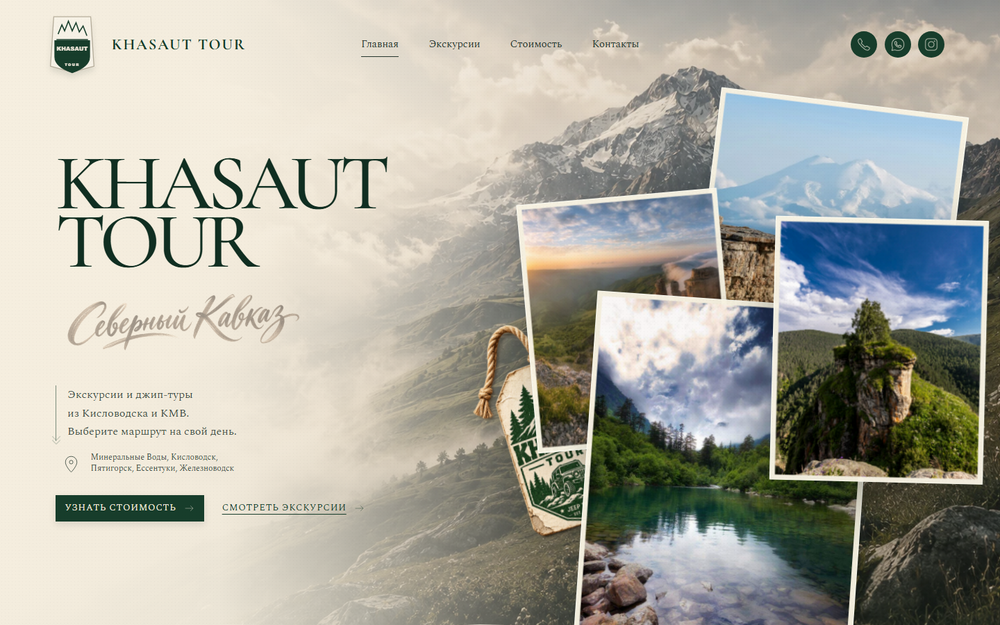

# Khasaut Tour

Лендинг экскурсионного бюро **Khasaut Tour** — джип-туры и экскурсии по Северному Кавказу из Кисловодска и КМВ.



---

## Стек

- **React 19** + **TypeScript**
- **Vite 8** — сборка и dev-сервер
- **CSS** без фреймворков — токены, кастомные свойства, адаптив
- **Playwright** — скриншоты и визуальный контроль
- Предрендеринг всех страниц (`scripts/prerender.mjs`) — статический HTML для SEO
- Автогенерация `sitemap.xml`, canonical, Open Graph и структурированных данных

## Страницы

| Маршрут | Описание |
|---|---|
| `/` | Главная |
| `/excursions` | Все экскурсии |
| `/prices` | Стоимость |
| `/contact` | Контакты |
| `/about` | О нас |
| `/elbrus`, `/dombay`, `/arkhyz`, … | Детальные страницы маршрутов |

## Запуск локально

```bash
npm install
npm run dev
```

Откройте [http://localhost:5173](http://localhost:5173)

## Сборка для хостинга

```bash
npm run build
```

Готовые файлы — в папке `dist/`. Загружайте содержимое `dist/` в `public_html` на REG.RU.  
Файл `.htaccess` включён в сборку для правильной маршрутизации на Apache.

## Структура проекта

```
src/
├── components/
│   ├── sections/       # Hero, Services, Routes, About, …
│   └── ui/             # Кнопки, карточки, навигация
├── data/               # Данные маршрутов и экскурсий
├── pages/              # Страницы (роутинг)
└── styles/             # Глобальные стили, токены, секции
docs/
├── screenshot-desktop.png
└── screenshot-mobile.png
scripts/
└── prerender.mjs       # Статический предрендер
dist/                   # Сборка (gitignore)
```

## Домен

[https://khasaut-kmv.ru](https://khasaut-kmv.ru)
